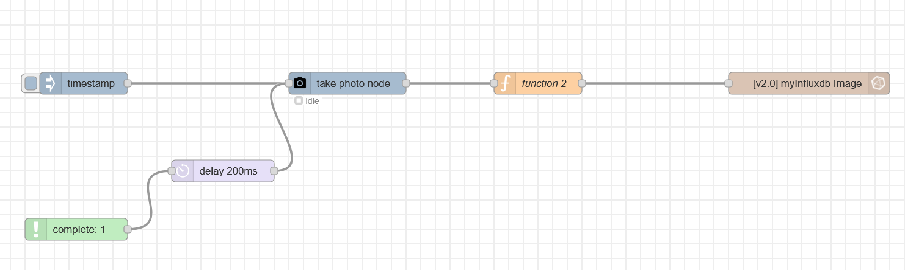

# @brdk/node-red-picamera2
A <a href="http://nodered.org" target="_new">Node-RED</a> node to take still photos on a Raspberry Pi using the **picamera2** library. This node will only work on a Raspberry Pi with a camera module enabled.

### Prerequisites on the Raspberry Pi

First, make sure your Raspberry Pi Camera is physically connected and detected. On Raspberry Pi OS Bookworm or later, the libcamera stack is enabled by default.

Install picamera2 if not already available:
```sh
        sudo apt-get update
        sudo apt-get install python3-picamera2
```

For 90°/270° rotation support, install Pillow:
```sh
        pip3 install Pillow
```

If you are using the default path during the file option set - the path ~/Pictures will be used.

### Runtime information
This node requires Raspberry Pi OS bookworm or later with the libcamera camera stack. Tested with a docker container running Python 3, Node.js 22, and Node-RED 4.x+.

## Quick start

1. Drag `picamera2-takephoto` into your flow.
2. Connect an `inject` node to trigger captures.
3. Connect a `debug` node to inspect output.
4. Select file mode: use `Buffered Mode` for in-memory processing, or use `Default` and `Auto File Name` to save to disk.
5. Deploy and trigger.

Example flow idea:
- `inject` -> `picamera2-takephoto (Buffered Mode)` -> `function (base64 encode)` -> storage/API node

Screenshot:



## Configuration fields

### File settings

- `File Mode`: `0` Buffered Mode, `1` Default, `2` Auto File Name
- `Image Name` (`autoname`): used in auto mode as base name (no extension)
- `File Name` (`filename`): used in default mode as base name (no extension)
- `File Path` (`filepath`): output folder, default `~/Pictures/`
- `File Format` (`fileformat`): `jpeg`, `png`, `bmp`

### Capture settings

- `Image Resolution`: predefined list from `320x240` up to `3280x2464`
- `Rotation`: `0`, `90`, `180`, `270`
- `Image Flip`: horizontal and vertical
- `Brightness`: `0` to `100` (mapped internally to libcamera range)
- `Contrast`: `-100` to `100`
- `Sharpness`: `-100` to `100`
- `Quality`: JPEG quality `0` to `100` (ignored for non-JPEG formats)
- `ISO`: `0` (auto) or fixed values `100` to `800`
- `Exposure`: `auto` or `manual`
- `AWB`: `auto`, `daylight`, `cloudy`, `tungsten`, `fluorescent`, `incandescent`, `indoor`
- `Wait for AGC` (`agcwait`): delay before capture in seconds
